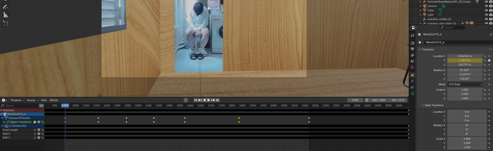

# Compositing

**View Render**

* Render Image : F12
* Compositing windows : Ctrl + Shift + Left click on Render Layer
* Alt + Middle Mouse to move the rendered image

<figure><figcaption></figcaption></figure>

**Add Color Management Node**

* Ctrl + A
* Color ⇒ Ajust ⇒ Color Balance

or Render properties ⇒ Color Managment ⇒ Look : Medium High Contrast

**Add Glare Node**

* Ctrl + A
* Filter ⇒ Glare
* Choose Straks or Fog Glow

**Add Mix Node**

* Ctrl + A
* Color ⇒ Mix ⇒ Mix Color
* Choose Mix or Add
* if Add, change fac to 0.01

**See changes directly**

* Change down tab to 3D Viewport
* Change Compositor to Always in Render option

<figure><figcaption></figcaption></figure>
