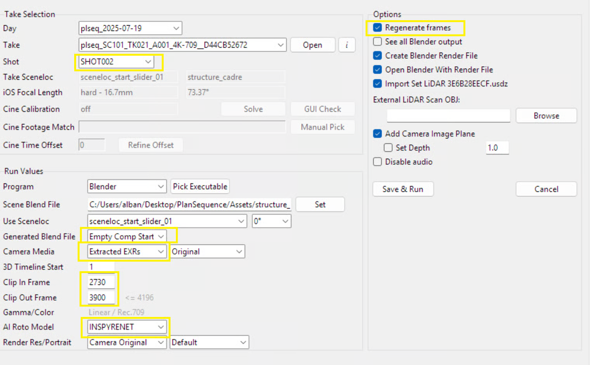

# Adjustment in Blender

**Adjust the Blender export from SynthEyes**

Save the blender scene opened automatically (temp file)

Select all elements

Scale all the elements (X = 0.01, Y = 0.01, Z = 0.01) in properties

**Export from Autoshot**

Open the Blender file generated from Autoshot (without INSPRYNET)

Uncheck Collection and Scan Collection

Select Scene Collection

File ⇒ Append ⇒ choose the blender temp file

Go to Collection ⇒ SynthEyses Collections

Hide the scan mesh

**With SynthEyses Geometry : Adjust the 3D env**

Select the 3D structure

Move the struture to snap to the SynthEyses Geometry (not from the viewport)

Check the first and last frame from the viewport

**or With Chisels : Adjust the floor ground**&#x20;

Unsee the main mesh in the SynthEyesWolrd (and unrender)

Select the SynthEyesWolrd

G + Z ⇒ Adjust the chisels to the ground level

Select the front chisel

Select SynthEyesWorld

Maj + S ⇒ Cursor to select

Cursor ⇒ 3D Cursor

<figure><figcaption></figcaption></figure>

R + X ⇒ Adjust the perspective with the other cursors

**Render check animation**

Output parameters :&#x20;

* Resolution : as in exported blender file from SynthEyes

or

* Resolution % = 105 %

Output ⇒ create a folder

Render ⇒ Render animation (without chisels)

**Renumber export with Autoshot**

In Autoshot, File ⇒ Renumber Image Sequence

Chose the created folder and select the first image

Enter New Starting Number = 1001

