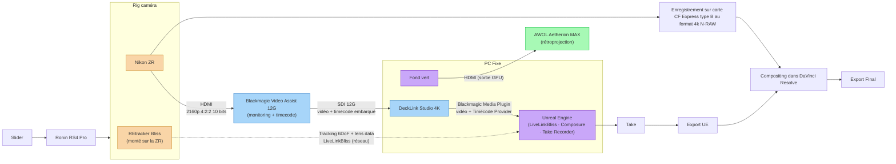
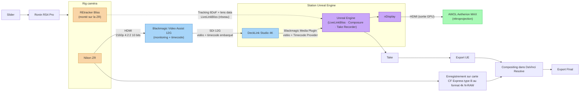

# Schéma

**Process préviz**

```mermaid
---
config:
  layout: dagre
---
flowchart LR
 subgraph RIG["Rig caméra"]
        BLISS["REtracker Bliss<br>(monté sur la ZR)"]
        ZR["Nikon ZR"]
  end
 subgraph STATION["PC Fixe"]
        DL["DeckLink Studio 4K"]
        UE["Unreal Engine<br>(LiveLinkBliss · Composure · Take Recorder)"]
        ND["Fond vert"]
  end
    ZR -- HDMI<br>2160p 4:2:2 10 bits --> VA["Blackmagic Video Assist 12G<br>(monitoring + timecode)"]
    VA -- SDI 12G<br>vidéo + timecode embarqué --> DL
    DL -- Blackmagic Media Plugin<br>vidéo + Timecode Provider --> UE
    BLISS -. Tracking 6DoF + lens data<br>LiveLinkBliss (réseau) .-> UE
    UE --> n2["Take"]
    ND -- HDMI (sortie GPU) --> PROJ["AWOL Aetherion MAX<br>(rétroprojection)"]
    ZR --> n1["Enregistrement sur carte CF Express type B au format 4k N-RAW"]
    n1 --> n3["Compositing dans DaVinci Resolve"]
    n2 --> n6["Export UE"]
    n4["Slider"] --> n5["Ronin RS4 Pro"]
    n5 --> RIG
    n6 --> n3
    n3 --> n7["Export FInal"]

    n1@{ shape: proc}
    n3@{ shape: proc}
    n4@{ shape: proc}
    n7@{ shape: proc}
    style BLISS fill:#f9d5a7,stroke:#c47f17
    style ZR fill:#f9d5a7,stroke:#c47f17
    style DL fill:#a7d5f9,stroke:#1770c4
    style UE fill:#c9a7f9,stroke:#6a17c4
    style ND fill:#c9a7f9,stroke:#6a17c4
    style VA fill:#a7d5f9,stroke:#1770c4
    style PROJ fill:#a7f9b5,stroke:#17c447
```

**Process prod**

```mermaid
---
config:
  layout: dagre
---
flowchart LR
 subgraph RIG["Rig caméra"]
        BLISS["REtracker Bliss<br>(monté sur la ZR)"]
        ZR["Nikon ZR"]
  end
 subgraph STATION["Station Unreal Engine"]
        DL["DeckLink Studio 4K"]
        UE["Unreal Engine<br>(LiveLinkBliss · Composure · Take Recorder)"]
        ND["nDisplay"]
  end
    ZR -- HDMI<br>2160p 4:2:2 10 bits --> VA["Blackmagic Video Assist 12G<br>(monitoring + timecode)"]
    VA -- SDI 12G<br>vidéo + timecode embarqué --> DL
    DL -- Blackmagic Media Plugin<br>vidéo + Timecode Provider --> UE
    BLISS -. Tracking 6DoF + lens data<br>LiveLinkBliss (réseau) .-> UE
    UE --> ND & n2["Take"]
    ND -- HDMI (sortie GPU) --> PROJ["AWOL Aetherion MAX<br>(rétroprojection)"]
    ZR --> n1["Enregistrement sur carte CF Express type B au format 4k N-RAW"]
    n1 --> n3["Compositing dans DaVinci Resolve"]
    n2 --> n6["Export UE"]
    n4["Slider"] --> n5["Ronin RS4 Pro"]
    n5 --> RIG
    n6 --> n3
    n3 --> n7["Export FInal"]

    n1@{ shape: proc}
    n3@{ shape: proc}
    n4@{ shape: proc}
    n7@{ shape: proc}
    style BLISS fill:#f9d5a7,stroke:#c47f17
    style ZR fill:#f9d5a7,stroke:#c47f17
    style DL fill:#a7d5f9,stroke:#1770c4
    style UE fill:#c9a7f9,stroke:#6a17c4
    style ND fill:#c9a7f9,stroke:#6a17c4
    style VA fill:#a7d5f9,stroke:#1770c4
    style PROJ fill:#a7f9b5,stroke:#17c447
```
